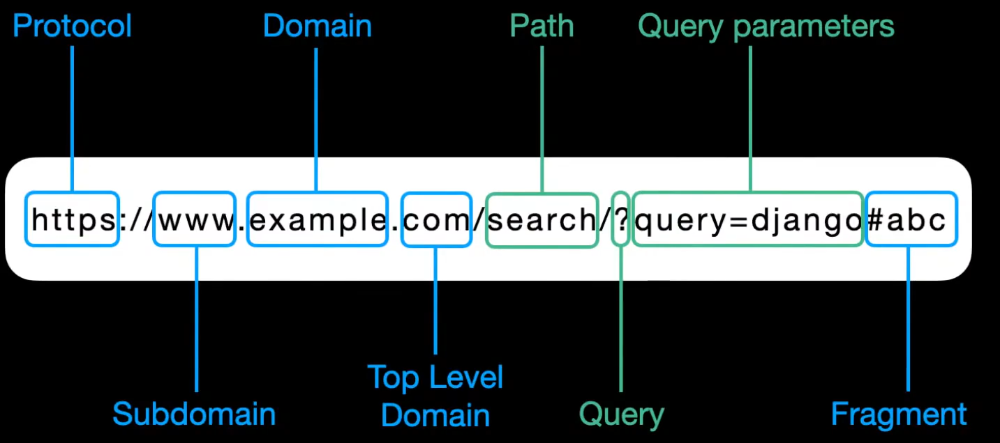
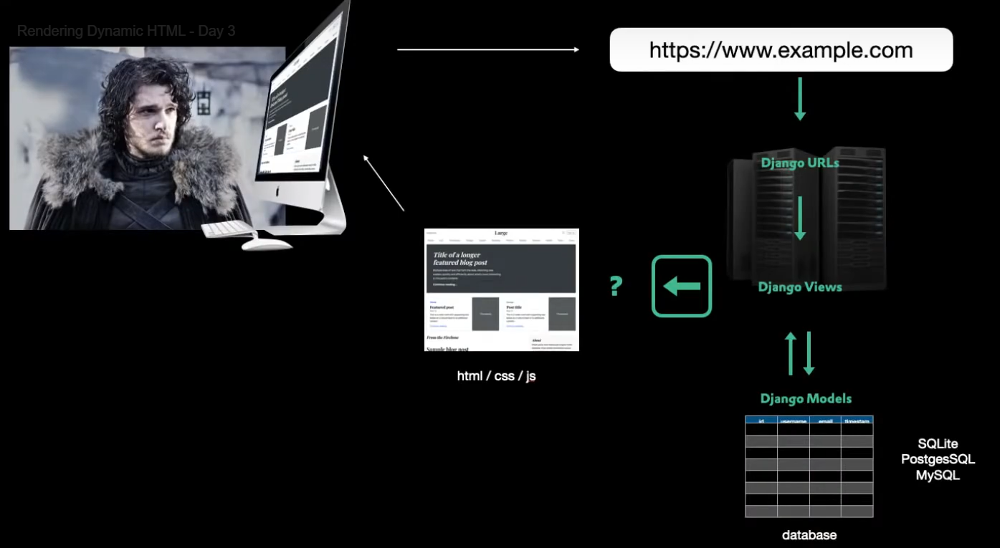
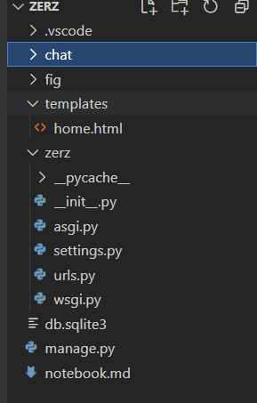
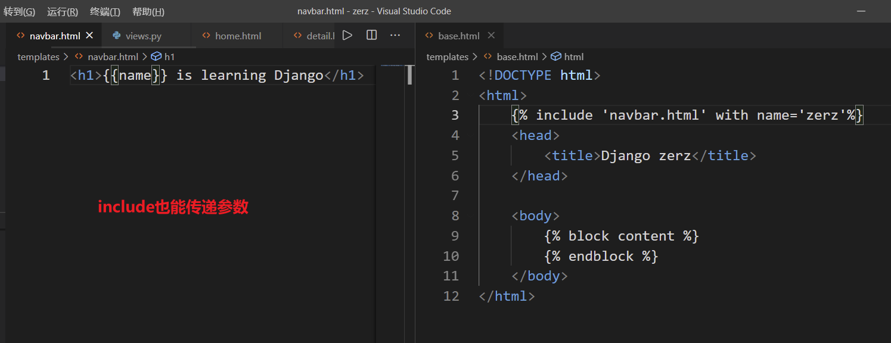
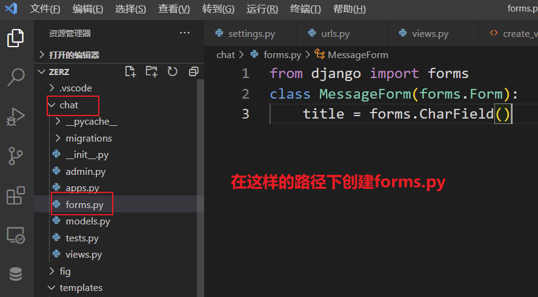
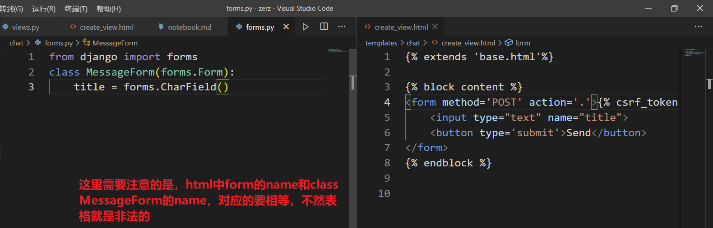

# 心得 + 笔记
### 519021910025 钟睿哲
- 本来是跟随官网教程学习Django，但是在学习的过程中感觉，虽然知道具体的操作能实现怎么的效果，但是对于为什么这么做不是很清楚
- 于是开始在网上找视频看，跟随这个视频学习 [https://www.bilibili.com/video/BV1fr4y1c7ey](https://www.bilibili.com/video/BV1fr4y1c7ey)
- 虽然这个教程覆盖的东西相对少一些，但是讲得非常详细，了解了具体函数的功能，都记在后面的笔记里面了
- 具体学到的话，就是跟随教程走，初步搭建了自己的网页
- 弄懂了view函数具体跳转的流程，以及model的搭建是与database紧密相关的
- 具体的框架已经初步掌握，接下来可能更加需要在功能和美观上下功夫
- 后面也会学习html + css + js，以django为框架进行网页的设计与开发
- 附：学习笔记


# Django学习笔记
### 钟睿哲
```
django-admin startproject <project_name>
```
- 创建一个新的项目 然后cd到有manage.py的目录下
```
py manage.py startapp <app_name>
```
- 创建新的app
```
py manage.py createsuperuser
```
- 用户名 邮箱可以不用填写 密码
- 需要将app的name加到installedapp里面去
- 创建model之后需要`py manage.py makemigrations` `py manage.py migrate`
- 后面修改models之后也需要迁移
- 在app的admin.py下面，需要
```python
from .models import Mymodel
admin.site.register(Mymodel)
```
- 这样之后app就被添加到admin界面上了
- shell操作
```python 
from <app_name>.models import my_model
q = my_model.objects.get(id=1)
q.message = 'change content'
q.save()
qs = Message.objects.all()
```
- qs之后就可以当作一个list进行使用了
```python
from django.contrib import admin
from django.urls import path
from chat import views
urlpatterns = [
    path('search/',views.home_view),
    path('admin/', admin.site.urls),
]
```
- 从自己写的app导入views，然后添加一个path，第一个参数相当于路径，类似于正则表达式截断，碰到这个路径就执行第二个参数，也就是自己写的view函数
```python
from django.shortcuts import render
from django.http import HttpResponse
# Create your views here.
def home_view(request,*args,**kwds):
    return HttpResponse('HelloWorld!')
```
- 接收一个request请求，返回一个HttpResponse，参数给字符串，这里也支持html语言
- 如果需要的话，也可以返回JsonResponse

```python
path('messages/<int:id>/',views.search_message),
```
- 动态的网页 url里面需要这么写
```python
  def search_message(request,id,*args,**kwds):
    obj = Message.objects.get(id=id)
    return HttpResponse(f'id is {obj.id} and title is {obj.title}')
```
- 然后views里面的函数需要这么写 指明传递参数的时候有个id

```python
def search_message(request,id,*args,**kwds):
    try:
        obj = Message.objects.get(id=id)
        return HttpResponse(f'id is {obj.id} and title is {obj.title}')
    except Message.DoesNotExist:
        raise Http404
```
- 抛出Http404错位，记得先导入

```python
def try_json_search(request,id):
    try:
        obj = Message.objects.get(id=id)
        return HttpResponse(f'This is message {obj.id} and content is {obj.content}')
    except Message.DoesNotExist:
        return JsonResponse({'Error':f'The message {id} does not exist'})
```
- JsonResponse返回一个字典 可以记录错误信息
- 前面传参数的时候，包括url动态截取的时候，最好不要用id这个名字，因为id也是django的一个内置的类型
- 不如换一个名字 pk


- 上面是html的组成，要好好掌握



- 请求url的具体流程



- 按照这样的路径创建一个templates文件夹
```python
TEMPLATES = [
    {
        'BACKEND': 'django.template.backends.django.DjangoTemplates',
        'DIRS': [BASE_DIR / 'templates'],
        'APP_DIRS': True,
        'OPTIONS': {
            'context_processors': [
                'django.template.context_processors.debug',
                'django.template.context_processors.request',
                'django.contrib.auth.context_processors.auth',
                'django.contrib.messages.context_processors.messages',
            ],
        },
    },
]
```
- settings里面这个DIRS需要写成这个样子，告诉django从这里去找这个模板
- 然后编写我们新建的、在templates下面写我们的html，然后view函数里面render渲染
- render的第一个参数永远是request，第二个是html的名字，第三个是一些其他的信息
```python
def home_view(request,*args,**kwds):
    # return HttpResponse('<h1>HelloWorld!</h1>')
    content ={
        'name':'zrz'
    }
    return render(request,'home.html',content)
```
```html
<h1>Welcome to home, {{name}}!</h1>
```
- html里面格式替换需要使用两个大括号

```html
<!DOCTYPE html>
<html>
    <head>
        <title>Django zerz</title>
    </head>

    <body>
        
        
    </body>
</html>
```
- 现在模板目录下创建base.html
- 用大括号加%相当于替换 block相当于类型 content相当于变量的名字
```html



<h1>Welcome to home, {{name}}!</h1>

```
- 然后在我们的html文件中，先从base继承，然后通过block传递我们的变量

```python
def details(request,pk,*args,**kwds):
    try:
        obj = Message.objects.get(id=pk)
        return render(request,'chat/detail.html',{'obj':obj})
    except Message.DoesNotExist:
        raise JsonResponse({'message':'Message does exist'})
```
- 比如这里我又定义了一个view函数，render里面第二个参数是我要渲染的html的路径，第三个参数是字典，是我要传递给html的参数
- 根据前面的设置，会从根目录下的templates去找，所以我需要在templates下面创建一个chat目录，然后在里面创建一个detail.html
```html


<h1>Title is {{obj.title}}</h1>
<p>content is {{obj.content}}</p>

```
- 这里需要注意，content块只能有一个，注释掉也不行
- 而且名字需要和extends的对应起来
- html的逻辑就是标签，if也好block也好，都需要声明end




```python
def show_all_message(request,*args,**kwds):
    qs = Message.objects.all()
    try:
        return render(request,'chat/showall.html',{'mess_list':qs})
    except:
        return Http404
```
- 在html中使用list 只要字典里面传一个list就可以了

```html

    
        <div>
            <h2>{{obj.title}}</h2>
            <p>{{obj.content}}</p>
        </div>
    

```
- 对应的html中写for循环就可以了
- ### 要注意，百分号和大括号之间千万不能有空格！！！！！
```html
<!DOCTYPE html>
<html>
     
    <head>
        <title>
            Django
        </title>
    </head>

    <body>
        
        
    </body>
</html>
```
- 注意base里面的title的地方 有一个title的块
```html


 
All messages - {{ block.super }}




    
        <div>
            <h2>{{obj.title}}</h2>
            <p>{{obj.content}}</p>
        </div>
    

```
- 在继承base的html子文件中，可以通过 ``的方式调用上一级的东西

```python
def bad_view(request,*args,**kwds):
    print(dict(request.GET))
    return HttpResponse('Do not use this bad view!')
```
- 使用get方法，GET返回一个字典，输入网址的时候这样输入``http://127.0.0.1:8000/bad/?k1=v1&k2=v2``表示一个query，`?`后面的参数就会以字典的形式返回了，注意value的形式是list

```python
def create_view(request,*args,**kwds):
    context = {}
    print(request.POST)
    print(request.GET)
    return render(request,'chat/create_view.html',context)
```
- 这里是如何使用POST的方法

```html



<form method='POST' action='.'>
    <input type="text" name="content">
    <button type='submit'>Send</button>
</form>

```
- 对应的html文件，创建一个小小的框，输入文本信息并提交到action所示的位置
- ````这个要加上来进行csrf验证
- 然后再打印POST的时候就能看到提交的东西了
- input标签里面的name意思是返回的数据的key是什么
```
[31/Mar/2021 20:49:40] "POST /create/view/ HTTP/1.1" 200 418
<QueryDict: {'csrfmiddlewaretoken': ['3OwZ8mncXCWBViV9g3xGZNv3ZacfU6iWAgQIBsTaGIra2JiqLnFrsyFk71LNpf36'], 'content': ['18265665559']}>
<QueryDict: {}>
```
- 这里可以看到很长的csrf的验证以及返回的POST的数据
- 因为GET没有给参数所以返回的是空字典
- 这里的`token`意思是令牌

```python
def create_view(request,*args,**kwds):
    context = {}
    # print(request.POST)
    # print(request.GET)

    post_data = request.POST or None
    # print(post_data)
    if post_data != None:
        # 根据POST的数据创建一个表格
        my_form = MessageForm(post_data)
        # print(my_form.is_valid())
        # 检验表格是否合法
        if my_form.is_valid():
            # 这样获取表格里面的数据
            print(my_form.cleaned_data.get('title'))
            # 创建一个新的Message 然后到admin去查看
            # 创建Message的时候传参数用kwds的形式
            Message.objects.create(title=my_form.cleaned_data.get('title'))
    return render(request,'chat/create_view.html',context)
```





```python
def create_view(request,*args,**kwds):
    # 这里要记得加None
    context = MessageForm(request.POST or None)
    if context.is_valid():
        print(context.cleaned_data.get('title'))
    Message.objects.create(title=context.cleaned_data.get('title'))
    # 把这个MessageForm作为字典的value传给html进行渲染

    # 加上这个可以清空表格
    context = MessageForm()
    return render(request,'chat/create_view.html',{'context':context})
```


```HTML



<form method='POST' action='.'>
    {{ context.as_p }}
    <button type='submit'>Send</button>
</form>

```

- 这样就没必要input标签name非要和匹配了 会自动根据class中的名字进行显示 非常方便
---
- 下面这个用了ModelForm，直接修改fields里面的东西就可以显示对应的，要注意fields里面的字段必须是定义的model里面有的才可以
```python
# 实际用的时候把ModelForm全都改成MessageModelForm就可以了
from django import forms
from .models import Message
class MessageModelForm(forms.ModelForm):
    class Meta:
        model = Message
        # 这里面有的参数必须包含在models
        fields = [
            'title',
            'content',
            'asker',
        ]
```

```python
# 可以传递字典的形式创建一个新的message
Message.objects.create(**context.cleaned_data)
```


```python
# 模型最好是给default值 这样迁移的时候不会报错
from django.db import models
class Message(models.Model):
    title = models.CharField(max_length=100,default='Please write your title here...')
    content = models.TextField(blank=True,default='Please write something here...')
    asker = models.CharField(max_length=100,default='Anonymous users')
# Create your models here.
```


```python
# 几个需要对应起来的地方
# 首先是view函数里面传递的这个字典的key，需要和html里面用到的保持一致
# 其次就是html里面的block，需要和extends的html命名保持一致
return render(request,'forms.html',{'context':context})
```

---
- ### 下面是注册、登录、注销等等操作
- 首先在根目录下创建`accounts`文件夹，这个使用cmd的命令 startapp
- 因为accounts下面不需要自己写model，而且admin网页已经有用户这个了，所以就不需要installapp
- accounts所需要的template放在`/templates/accounts`下面
```python
# 这个用来定义登录、注册的类
# 显示登录、注册界面的时候就会显示他们的属性
from django.contrib.auth import get_user_model
from django import forms
# 先获取一个User的类的实例
User = get_user_model()

# 这个是用来禁止非法用户名
UNALLOWED_USER_NAME = ['zerz']

# 登录表
class LoginForm(forms.Form):
    # 使用initial来初始化 不是default
    username = forms.CharField(initial='username')
    password = forms.CharField(
        initial= None,
        widget = forms.PasswordInput(
            attrs={
                'class' : 'form-control',
                'id' : 'password',
            }
        )
    )


    def clean_username(self):
        # cleaned_data就得到Form子类的字典了
        username = self.cleaned_data.get('username')
        qs = User.objects.filter(username__iexact=username)
        if not qs.exists():
            raise forms.ValidationError('This is an invalid user! And this message is from clean_username.')
        return username


class RegisterForm(forms.Form):
    username = forms.CharField(initial='username')

    # 表示这个字段是必须的
    email = forms.EmailField(required=True,initial='email@example.com')
    password = forms.CharField(
        initial = None,
        label = 'password',
        widget = forms.PasswordInput(
            attrs={
                'class' : 'form-control',
                'id' : 'password',
            }
        )
    )

    password2 = forms.CharField(
        initial = None,
        label = 'password2',

        # 这个是单纯针对密码的一些小控件
        widget = forms.PasswordInput(
            attrs={
                'class' : 'form-control',
                'id' : 'password2',
            }
        )
    )
    # 检查用户名合法性，目前不知道为什么还不行
    def clean_username(self):
        username = self.cleaned_data.get('username')
        qs = User.objects.filter(username__iexact=username)
        if qs.exists() or username in UNALLOWED_USER_NAME:
            raise forms.ValidationError('This is an invalid username, please pick another!')
        return username

    # 检查email合法性，目前不知道为什么还不行
    def clean_email(self):
        email = self.cleaned_data.get('email')
        qs = User.objects.filter(username__iexact=email)
        if qs.exists():
            raise forms.ValidationError('This email is already used, please pick another!')
        return email
```
```python
from django.shortcuts import render,redirect
from django.http import HttpResponse,Http404,JsonResponse
from django.contrib.auth import authenticate,login,logout,get_user_model
from .forms import (
    LoginForm,
    RegisterForm
)
# Create your views here.

def login_view(request):
    form = LoginForm(request.POST or None)

    # 只有vaild之后才能使用cleaned_data
    if form.is_valid():
        username = form.cleaned_data.get('username')
        password = form.cleaned_data.get('password')

        # Django默认进行验证
        user = authenticate(request,password=password,username=username)
        if user == None:
            request.sessions['invalid_user'] = 1
            return redirect('/login')
        login(request,user)

        # 这个地方要注意，传给需要渲染的html的时候，需要传递一个字典，而form是一个Form类的子类
        return render(request,'accounts/login_success.html',{'context':form.cleaned_data})
    
    # 如果登录失败就会返回login界面，这个时候需要传递form用于html里面的as_p
    return render(request,'accounts/login.html',{'context':form})
    
# 退出 然后重定向
def logout_view(request):
    logout(request)
    return redirect('/login')


def register_view(request):
    form = RegisterForm(request.POST or None)
    if form.is_valid():
        username = form.cleaned_data.get('username')
        email = form.cleaned_data.get('email')
        password = form.cleaned_data.get('password')
        password2 = form.cleaned_data.get('password2')

        User = get_user_model()
        try:
            user = User.objects.create_user(username=username,password=password,email=email)
        except :
            user = None
        if user != None:
            login(request,user)
            form_data = form.cleaned_data
            return render(request,'accounts/reg_success.html',{'context':form_data})
        else:
            request.sessions['register_error'] = 1
    form = RegisterForm()
    return render(request,'accounts/register.html',{'context':form})
```
#### 登录成功后自己添加了一个按钮 可以跳转到create界面
[各种url跳转](https://blog.csdn.net/iteye_12894/article/details/81894073)
```html
 

<h1> {{ context.username}} Login Successfully!</h1>
<button onclick="location='/create/view'">Click me to create message</button>

```
#### 使用`@login_required`装饰器，需要设置跳转的url
```python
LOGIN_URL = '/login'
LOGIN_REDIRECT_URL = '/'
```
#### 使用`@login_required`装饰器
```python
from django.contrib.auth.decorators import login_required

@login_required
def create_message_view(request,*args,**kwds):
    # 这里要记得加None
    context = MessageForm(request.POST or None)

    if context.is_valid():
        # cleaned_data应该是可以去掉csrf的验证
        # 然后拿到一个字典
        print(context.cleaned_data.get('title'))
        Message.objects.create(**context.cleaned_data)
    # 把这个MessageForm作为字典的value传给html进行渲染

    # 加上这个可以清空表格
    context = MessageForm()
    # return render(request,'chat/create_view.html',{'context':context})
    return render(request,'forms.html',{'context':context})
```